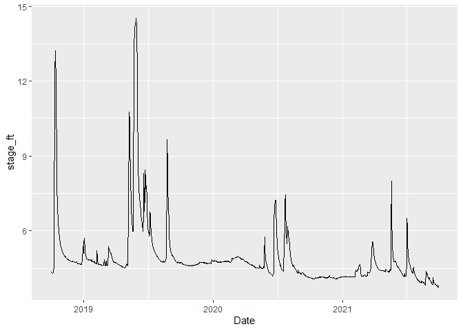

Carpentries Rmd Example
================

# Script purposes and organization

This is an example Rmd script developed during a Carpentries workshop.
In this script, we will develop a workflow and report that does the
following tasks: 1. Prepares the R environment 2. Download and save USGS
stream stage data 3. Tidy, QAQC, and gap-fill the data and save the
processed data 4. Write up some summary statistics.

## 1. Prepare the R environment

We will load any relevant packages and set the default for our code to
appear in our final markdown document.

``` r
knitr::opts_chunk$set(echo = TRUE)
library(dataRetrieval)
```

    ## Warning: package 'dataRetrieval' was built under R version 4.1.3

``` r
library(dplyr)
```

    ## Warning: package 'dplyr' was built under R version 4.1.3

    ## 
    ## Attaching package: 'dplyr'

    ## The following objects are masked from 'package:stats':
    ## 
    ##     filter, lag

    ## The following objects are masked from 'package:base':
    ## 
    ##     intersect, setdiff, setequal, union

``` r
library(zoo)
```

    ## Warning: package 'zoo' was built under R version 4.1.3

    ## 
    ## Attaching package: 'zoo'

    ## The following objects are masked from 'package:base':
    ## 
    ##     as.Date, as.Date.numeric

``` r
library(lubridate)
```

    ## Warning: package 'lubridate' was built under R version 4.1.3

    ## 
    ## Attaching package: 'lubridate'

    ## The following objects are masked from 'package:base':
    ## 
    ##     date, intersect, setdiff, union

``` r
library(ggplot2)
```

    ## Warning: package 'ggplot2' was built under R version 4.1.3

## 2. Download and save USGS stream stage data.

We will use the `readNWISdv` function from the `dataRetrieval` package
to download stream stage data for the USGS gage on the Arkansas River
near Larned KS. To do this, we will need to provide the 8-digit gage ID
number (07141220), the start/end date, and the parameter code for stage
(00065; discharge is 00060).

``` r
# gage ID
usgs_id <- "07141220"
# download data
data_raw <- 
  readNWISdv(siteNumbers = usgs_id,
             parameterCd = "00065",
             startDate = "2018-10-01",
             endDate = "2021-09-30")
# inspect data
summary(data_raw)
```

    ##   agency_cd           site_no               Date            X_00065_00003   
    ##  Length:1089        Length:1089        Min.   :2018-10-01   Min.   : 3.760  
    ##  Class :character   Class :character   1st Qu.:2019-07-03   1st Qu.: 4.330  
    ##  Mode  :character   Mode  :character   Median :2020-03-31   Median : 4.670  
    ##                                        Mean   :2020-03-31   Mean   : 4.919  
    ##                                        3rd Qu.:2020-12-28   3rd Qu.: 4.850  
    ##                                        Max.   :2021-09-30   Max.   :14.510  
    ##  X_00065_00003_cd  
    ##  Length:1089       
    ##  Class :character  
    ##  Mode  :character  
    ##                    
    ##                    
    ## 

``` r
# save data
write.csv(data_raw, "data/ExampleStreamStage_Raw.csv")
```

## 3. Tidy, QAQC, and gap-fill the data and save the processed data

In this section, we will perform some basic data cleaning operations to
get our data ready for further analysis.

``` r
# create a new data frame with better column names
data_tidy <-
  data_raw %>% 
  rename(stage_ft = X_00065_00003,
         stage_QAcode = X_00065_00003_cd) %>% 
  select(-agency_cd, -site_no)
# look at our new data frame
head(data_tidy)
```

    ##         Date stage_ft stage_QAcode
    ## 1 2018-10-01     4.35            A
    ## 2 2018-10-02     4.34            A
    ## 3 2018-10-03     4.32            A
    ## 4 2018-10-04     4.30            A
    ## 5 2018-10-05     4.31            A
    ## 6 2018-10-06     4.34            A

``` r
# first thing to do is always plot!
ggplot(data_tidy, aes(x = Date, y = stage_ft)) +
  geom_line()
```

<!-- -->

``` r
# check for missing dates by comparing all possible dates to the dates you have
first_date <- min(data_tidy$Date)
last_date <- max(data_tidy$Date)
all_dates <- seq(first_date, last_date, by = "day")  # make vector of all dates
length(all_dates) == length(data_tidy$Date)  # check for missing dates
```

    ## [1] FALSE

``` r
missing_dates <- all_dates[!(all_dates %in% data_tidy$Date)]
# add missing dates to your data frame - we will need to make a new df with the same columns, bind them together, and arrange by date
new_dates <- data.frame(Date = missing_dates, 
                        stage_ft = NA,
                        stage_QAcode = "Gapfill")
data_clean <- 
  bind_rows(data_tidy, new_dates) %>% 
  arrange(Date)
summary(data_clean)
```

    ##       Date               stage_ft      stage_QAcode      
    ##  Min.   :2018-10-01   Min.   : 3.760   Length:1096       
    ##  1st Qu.:2019-07-01   1st Qu.: 4.330   Class :character  
    ##  Median :2020-03-31   Median : 4.670   Mode  :character  
    ##  Mean   :2020-03-31   Mean   : 4.919                     
    ##  3rd Qu.:2020-12-30   3rd Qu.: 4.850                     
    ##  Max.   :2021-09-30   Max.   :14.510                     
    ##                       NA's   :7

``` r
# fill in those gaps using linear interpolation, from the zoo package
# ?na.approx
# na.approx(c(1, 2, NA, 4))
data_clean$stage_ft <- na.approx(data_clean$stage_ft) # can set a maxgap if you want
summary(data_clean)
```

    ##       Date               stage_ft      stage_QAcode      
    ##  Min.   :2018-10-01   Min.   : 3.760   Length:1096       
    ##  1st Qu.:2019-07-01   1st Qu.: 4.330   Class :character  
    ##  Median :2020-03-31   Median : 4.670   Mode  :character  
    ##  Mean   :2020-03-31   Mean   : 4.920                     
    ##  3rd Qu.:2020-12-30   3rd Qu.: 4.853                     
    ##  Max.   :2021-09-30   Max.   :14.510

``` r
# plot and inspect
ggplot(data_clean, aes(x = Date, y = stage_ft, color = stage_QAcode)) +
  geom_point()
```

<!-- -->

``` r
# save data
write.csv(data_raw, "data/ExampleStreamStage_Clean.csv")
```

## 4. Write up some summary statistics

We analyzed data from USGS gage 07141220. During the period of record,
the maximum stage was 14.51 and the minimum stage was 3.76.
